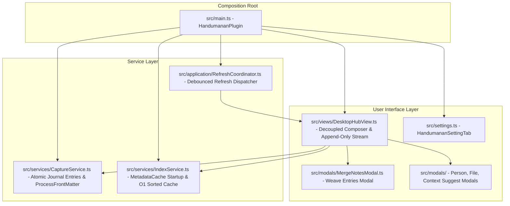

# System Patterns: Handumanan — Life Journaling OS Architecture

## 1. Tech Stack & Dependencies
*   **Compilation**: Compiled via `esbuild.config.mjs` from `src/main.ts` into a single file `main.js`, with style declarations in `styles.css`. Builds are deployed to `/Users/K26/Obsidian/K0000/.obsidian/plugins/handumanan`.
*   **TypeScript**: Targeted at `ESNext` modules with strict type checks.
*   **Dependencies**: Obsidian API, `chrono-node` for natural-language dates.

---

## 2. Core Service Architecture

Handumanan uses an event-driven, production-grade journaling architecture:

### Capture Service (`src/services/CaptureService.ts`)
*   Manages atomic note creation in `<journalFolder>/YYYY/MM/YYYY-MM-DD HH.mm.ss.md` (default: `000 Bin/Handumanan/`).
*   Uses Obsidian's official `this.app.fileManager.processFrontMatter` for atomic, crash-safe YAML mutations (`updateNoteContent`, `toggleFavorite`).
*   In-memory collision protection via `app.vault.getAbstractFileByPath` (eliminating TOCTOU adapter races).
*   Zero-data-loss draft persistence with 300ms debounce to eliminate keystroke I/O lag.
*   Pebble-Drop support: allows recording 1-tap presence check-ins when depleted.
*   Multi-entry weaving (`mergeNotes`) with provenance tracking (`wovenInto: [[Target]]`, `synthesized: true`) and non-destructive retention of atomic entries by default.

### Index Service (`src/services/IndexService.ts`)
*   Instantaneous startup via `this.app.metadataCache.getFileCache(file)`, bypassing disk reads for 10,000+ notes.
*   Secondary lookup maps with zero memory leaks (`_entriesByDay`, `_entriesByPerson`, `_entriesByMood`), cleanly evicted on note updates.
*   Cached O(1) sorted entry retrieval via `_isSortedDirty` dirty flag.
*   Psychological safety: `getOnThisDayEntries()` and `getRandomMemory()` automatically exclude `private: true` or `type: 'unburdening'` to prevent accidental exposure of raw grief or confidential thoughts.

### Refresh Coordinator (`src/application/RefreshCoordinator.ts`)
*   Coalesces rapid file system mutations (e.g. sync batches) with 250ms debouncing.
*   Safely dispatches scoped updates without thrashing the main thread or tearing down the UI.

---

## 3. Sanctuary & River View System (`DesktopHubView`)

The primary interactive hub operates in two complementary psychological states:
1.  **River Mode (Reading & Reflection)**:
    *   Centered editorial container clamped to `min(68ch, calc(100vw - 32px))`.
    *   Relaxed line height (`1.72`) and organic spacing.
    *   Append-only infinite scrolling (zero DOM destructions when loading older batches).
    *   Hairline day dividers ("Today · September 27", "Yesterday").
    *   Borderless journal leaves with time of day, mood badges, word count, and reading time.
2.  **Sanctuary Mode (Deep Writing)**:
    *   Invoked via `✦ Sanctuary` button, command, or `focusComposer()`. Exited with `Escape`.
    *   Stream dims with soft vignette and grayscale blur (`opacity: 0.2; filter: grayscale(50%)`).
    *   Header and filter carousels fade to 30% opacity to eliminate peripheral distractions.
    *   Composer elevates with fluid vertical expansion up to 55vh.
    *   Circadian prompt decks automatically align with the hour (Morning Awakening, Midday Grounding, Evening Unburdening).
3.  **Privacy Shield Mode**:
    *   Toggled via `⌘+Shift+P` or header eye icon.
    *   Blurs reflection text (`filter: blur(9px)`) against shoulder-surfing and screen shares.
    *   Strict click-to-reveal only (no accidental mouse hover unblur).
4.  **Temporal Scrubber**:
    *   Fast filters: `📖 All Journal`, `📅 Today`, `✨ On This Day`, `❤️ Keepsakes`, `🌧️ Unburdening`.
    *   Theme-adaptive WCAG AA contrast tokens for light and dark themes.
