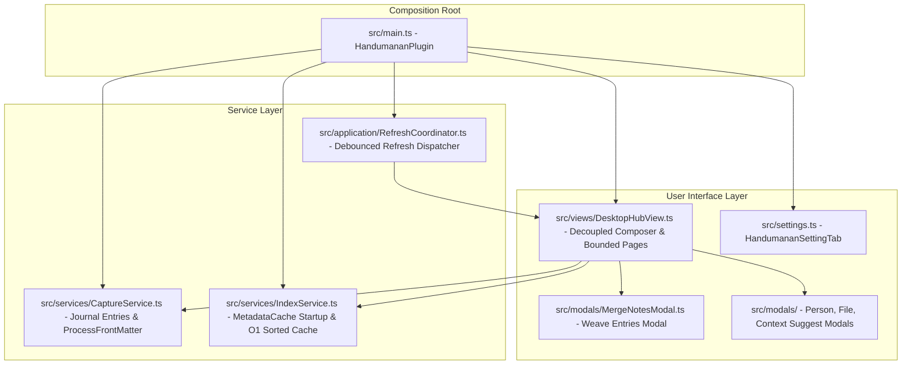

# System Patterns: Handumanan Journal Architecture

## 1. Tech Stack & Dependencies
*   **Compilation**: Compiled via `esbuild.config.mjs` from `src/main.ts` into a single file `main.js`, with style declarations in `styles.css`. Copy `main.js`, `manifest.json`, and `styles.css` to `<vault>/.obsidian/plugins/handumanan/` after building; the build does not deploy automatically.
*   **TypeScript**: Targeted at `ESNext` modules with strict type checks.
*   **Dependencies**: Obsidian API, `chrono-node` for natural-language dates.

---

## 2. Core Service Architecture

Handumanan uses an event-driven journal architecture:

### Capture Service (`src/services/CaptureService.ts`)
*   Manages atomic note creation in `<journalFolder>/YYYY/MM/YYYY-MM-DD HH.mm.ss.md` (default: `000 Bin/Handumanan/`).
*   Edits use `app.vault.process` for one read-modify-write of frontmatter and body, preserving untouched YAML text. A per-file queue orders plugin-origin edits, keepsake toggles, deletes, and weave mutations. The inline editor compares the body it opened against the current body and rejects changed content instead of overwriting it; external editors and sync tools still require testing.
*   In-memory collision protection via `app.vault.getAbstractFileByPath` (eliminating TOCTOU adapter races).
*   Debounced local draft persistence (300ms) reduces writes while typing; this is not a guarantee against all data loss.
*   Pebble-Drop support: allows recording 1-tap presence check-ins when depleted.
*   Multi-entry weaving (`mergeNotes`) with provenance tracking (`wovenInto: [[Target]]`, `synthesized: true`) and non-destructive retention of atomic entries by default.

### Index Service (`src/services/IndexService.ts`)
*   Startup uses `this.app.metadataCache.getFileCache(file)` where available and falls back to disk reads in batches of at most 16. A synthetic metadata-only 10,000-entry test records indexing time, but actual Obsidian device/vault performance remains unmeasured.
*   Secondary lookup maps (`_entriesByDay`, `_entriesByPerson`, `_entriesByMood`) are updated on note changes. Out-of-order reads are discarded by per-file generations; failed reads retain the last valid entry.
*   Sorted entry retrieval is cached behind an `_isSortedDirty` dirty flag; rebuilding the sorted array still has a cost.
*   Psychological safety: `getOnThisDayEntries()` and `getRandomMemory()` automatically exclude `private: true` or `type: 'unburdening'` to prevent accidental exposure of raw grief or confidential thoughts.

### Refresh Coordinator (`src/application/RefreshCoordinator.ts`)
*   Coalesces rapid file system mutations (e.g. sync batches) with 250ms debouncing.
*   Safely dispatches scoped updates without thrashing the main thread or tearing down the UI.

---

## 3. Sanctuary & River View System (`DesktopHubView`)

The primary interactive hub operates in two complementary psychological states:
1.  **River Mode (Reading & Reflection)**:
    *   Full-width container that fills the available Obsidian pane with responsive desktop, tablet, and mobile padding.
    *   Relaxed line height (`1.72`) and organic spacing.
    *   Bounded 25-entry pagination with Older/Newer controls to prevent unbounded stream DOM growth.
    *   Hairline day dividers ("Today · September 27", "Yesterday").
    *   Borderless journal leaves with time of day, mood badges, word count, and reading time.
2.  **Sanctuary Mode (Deep Writing)**:
    *   Invoked via `✦ Sanctuary` button, command, or `focusComposer()`. Exited with `Escape`.
    *   Stream dims with soft vignette and grayscale blur (`opacity: 0.2; filter: grayscale(50%)`).
    *   Header and filter carousels fade to 30% opacity to eliminate peripheral distractions.
    *   Composer elevates with fluid vertical expansion up to 55vh.
    *   Circadian prompt decks automatically align with the hour (Morning Awakening, Midday Grounding, Evening Unburdening).
3.  **Privacy Shield Mode**:
    *   Toggled via the command palette or header eye icon; users may assign a hotkey in Obsidian.
    *   Blurs reflection text (`filter: blur(9px)`) against shoulder-surfing and screen shares.
    *   Reveals text through an explicit per-entry button, not hover. The blur does not encrypt or restrict access to Markdown files.
4.  **Temporal Scrubber**:
    *   Fast filters: `📖 All Journal`, `📅 Today`, `✨ On This Day`, `❤️ Keepsakes`, `🌧️ Unburdening`.
    *   Theme-adaptive WCAG AA contrast tokens for light and dark themes.
5.  **Phone Capture Dock**:
    *   `Platform.isMobile && !isTablet(app)` sets `is-phone-layout` on the journal container; phone CSS follows this state rather than treating exactly 768px as a phone.
    *   The persistent bottom composer keeps its draft textarea mounted, places Record beside the input, and places mood choices and private-entry control in a scrollable secondary row. Search hides the composer and filters as before.
    *   Header Search and Privacy Shield remain direct controls; an Obsidian `Menu` houses Sanctuary, Recall, Select, and Settings on phones. Desktop/tablet retain the top composer and direct header actions.
    *   With the keyboard open, the outer workspace root remains the sole vertical scroller. The inner phone container uses `overflow: visible !important` (overriding its `overflow-x: hidden !important` rule), `flex: 0 0 auto`, and `min-height: 100%`; the stream cannot shrink to zero. Obsidian already resizes its mobile container, so do not subtract keyboard height from the root or force `100dvh`. The viewport helper detects `--keyboard-height` as well as visual viewport changes and only scrolls an input if it is obscured.
